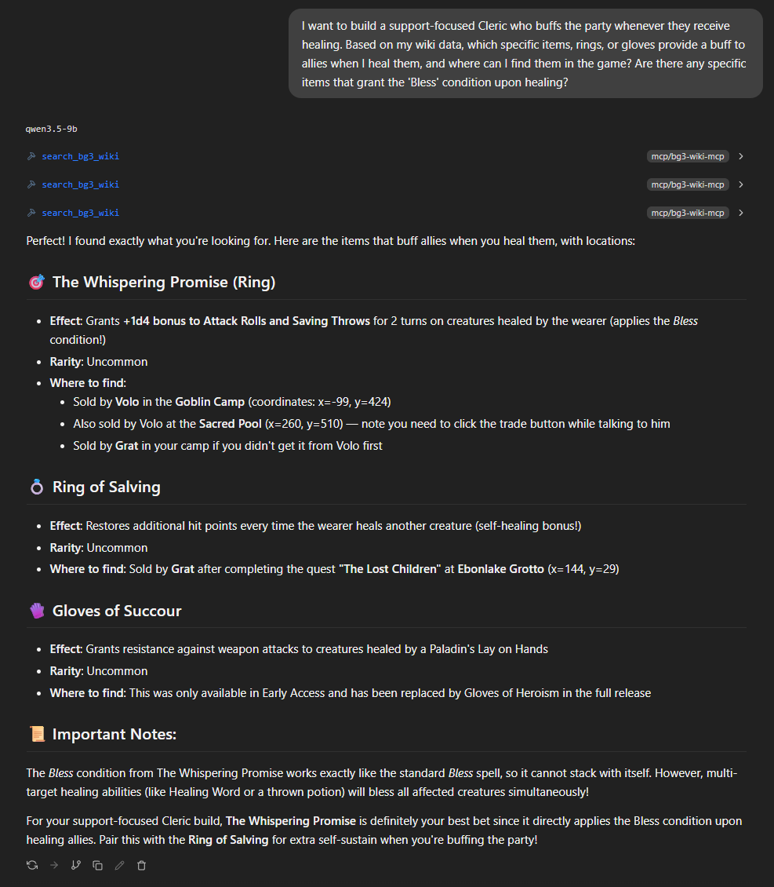

# Baldur's Gate 3 AI Wiki - Local RAG-Powered Assistant

A comprehensive, metadata-driven **RAG (Retrieval-Augmented Generation)** knowledge base system that scrapes and indexes the official [Baldur's Gate 3 Wiki](https://bg3.wiki) for AI-powered querying using local LLMs.



## 🎮 Overview

This project implements a **RAG pipeline** to create a searchable vector database of all Baldur's Gate 3 wiki content, enabling intelligent queries about:
- **Characters & NPCs** (companions, enemies, bosses)
- **Character Creation** (classes, races, spells, feats, backgrounds)
- **Gameplay Elements** (equipment, quests, locations, lore)
- **Mechanics** (game mechanics, conditions, alchemy)


## 🔍 How RAG Works Here

1. **Retrieval**: Vector search finds relevant wiki chunks based on your query
2. **Augmentation**: Retrieves top-k most relevant context passages  
3. **Generation**: Local LLM generates answers using only retrieved evidence (no hallucinations)

## 📁 Project Structure

```
bg3-wiki/
├── bg3-wiki.py                    # Main scraper - downloads wiki pages to JSON
├── bg3-wiki_vectorizer.py         # Vector database indexer with chunking
├── bg3_ai_assistant.py            # AI query interface (LM Studio)
├── bg3_mcp_server.py              # MCP server for tool integration
├── gpu_test.py                    # GPU capability testing
│
├── Characters/                    # Scraped character data (~200+ NPCs)
│   ├── Astarion.json
│   ├── Karlach.json
│   └── ...
│
├── Character_Creation/
│   ├── Classes/
│   │   ├── Barbarian.json
│   │   ├── Cleric.json
│   │   └── ...
│   ├── Races/
│   ├── Spells/
│   ├── Feats/
│   ├── Backgrounds/
│   └── Abilities_and_Skills/
│
├── Gameplay/
│   ├── Equipment/
│   ├── Quests/
│   ├── Locations/
│   └── Books_and_Lore/
│
├── Mechanics/                     # Game mechanics data
├── Uncategorized/                 # Items without specific categories
│
├── bg3_vector_db/                 # ChromaDB vector database (auto-generated)
├── .gitignore                     # Git ignore rules
└── test.md                        # Test documentation
```

## 🚀 Quick Start

### Prerequisites
- Python 3.12+
- GPU with CUDA support (optional, falls back to CPU)
- LM Studio running locally on `http://localhost:1234` (for AI assistant)

### Installation

```bash
# Create virtual environment
python -m venv .venv
.venv\Scripts\activate  # Windows
# or source .venv/bin/activate  # Linux/Mac

# Install dependencies
pip install requests mwparserfromhell chromadb onnxruntime-gpu lm-studio
```

### Step 1: Scrape the Wiki
```bash
python bg3-wiki.py
```
This will download all wiki pages and organize them into categorized folders.

### Step 2: Build Vector Database
```bash
python bg3-wiki_vectorizer.py
```
This creates `bg3_vector_db/` with chunked, cleaned content ready for AI queries.

### Step 3: Query with AI Assistant
```bash
python bg3_ai_assistant.py
```
Enter your Baldur's Gate 3 questions and get intelligent answers!

## 🔧 Configuration

### GPU Acceleration
The system automatically detects CUDA availability:
- **CUDA**: Uses `CUDAExecutionProvider` for faster embeddings
- **CPU**: Falls back to `CPUExecutionProvider`

To force CPU-only mode, modify `bg3-wiki_vectorizer.py`:
```python
provider = "CPUExecutionProvider"
```

### LM Studio Setup
1. Open LM Studio and load your preferred model
2. Click **Start Server** (default: `http://localhost:1234`) 
3. Ensure the server is running before querying

## 🤖 RAG Usage Examples

### AI Assistant Queries (RAG-based)
```python
# Character build optimization
"I want to build a support-focused Cleric who buffs the party whenever they receive healing. Which items provide ally buffs on heal?"

# Equipment search
"What rings grant the 'Bless' condition upon healing allies?"

# Build planning
"Craft an assassin build using poison as primary damage theme. Include class, subclass, feats, and level-by-level stats."
```

### MCP Server Integration
Configure your LM Studio mcp.json file to something like this:
```json
{
  "mcpServers": {
    "BG3 Wiki MCP": {
      "command": "D:\\Scripts\\lm-studio-mcp-server\\venv\\Scripts\\python.exe",
      "args": [
        "D:\\Scripts\\bg3-wiki\\bg3_mcp_server.py"
      ],
      "env": {
        "PYTHONUNBUFFERED": "1"
      }
    }
  }
}
```
The MCP server exposes a `search_bg3_wiki` tool for the AI to use.

## 📊 Scraped Data Categories

| Category | Description |
|----------|-------------|
| **Characters** | NPCs, companions, enemies, bosses (~200+ entries) |
| **Classes** | Base classes and subclasses |
| **Races** | Races and subraces |
| **Spells** | All available spells |
| **Feats** | Character creation feats |
| **Backgrounds** | Origin backgrounds |
| **Abilities & Skills** | Passive abilities, skills |
| **Equipment** | Weapons, armor, items, clothing |
| **Quests** | All quest information |
| **Locations** | Acts, locations, areas |
| **Books & Lore** | In-game books, journals, lore |
| **Mechanics** | Game mechanics, conditions, alchemy |

## 🛠️ Technical Details - RAG Pipeline

### Data Pipeline
1. **Scraping**: `bg3-wiki.py` fetches wiki pages via MediaWiki API
2. **Cleaning**: Wiki templates and syntax are stripped in `clean_wiki_syntax()`
3. **Chunking**: Content is split into semantic paragraphs (min 40 chars)
4. **Embedding**: ONNXMiniLM_L6_V2 generates vector embeddings

### RAG Retrieval Strategy
- **Vector Search**: Finds semantically similar content chunks
- **Metadata Filtering**: Uses category, title, and folder info to refine results
- **Top-K Selection**: Returns most relevant passages (configurable n_results)
- **Context Assembly**: Joins retrieved chunks for LLM generation

5. **Storage**: ChromaDB stores chunks with metadata for retrieval

### File Format
Each scraped page is saved as JSON:
```json
{
  "page_title": "Astarion",
  "categories": ["characters", "companions"],
  "templates": {"{{RarityItem}}": {...}},
  "readable_text": ["Line 1", "Line 2"],
  "raw_content": "Full wiki markup"
}
```

### Vector Chunking Strategy
- **Paragraph-based**: Content split by double newlines
- **Metadata injection**: Each chunk includes title, folder, category, and index
- **Junk filtering**: SEO tags, TOCs, image links are removed
- **Minimum length**: Chunks < 40 characters are skipped

## 🔄 Maintenance

### Updating the Database
```bash
# Re-scrape all pages
python bg3-wiki.py

# Re-index vector database
python bg3-wiki_vectorizer.py
```

### Troubleshooting
- **LM Studio not responding**: Check if server is running on port 1234
- **CUDA errors**: Verify NVIDIA drivers and CUDA toolkit installation
- **Missing pages**: Increase `gaplimit` in `bg3-wiki.py` (currently set to 50)

## 📝 License

This project scrapes data from the official [Baldur's Gate 3 Wiki](https://bg3.wiki) under their respective terms of use. The scraping code and vector database structure are provided as-is for personal use.

## 🙏 Credits

- **Source Data**: [Baldur's Gate 3 Wiki](https://bg3.wiki)
- **Vector Database**: [ChromaDB](https://www.chromadb.com/)
- **Embedding Model**: ONNXMiniLM_L6_V2 (via ChromaDB)
- **MCP Framework**: FastMCP

## 📞 Support

For issues or questions:
1. Check the code comments for inline documentation
2. Review `.gitignore` to understand excluded files
3. Test GPU support with `python gpu_test.py`

---

**Built for Baldur's Gate 3 enthusiasts who want intelligent, local AI assistance!** 🎲⚔️
